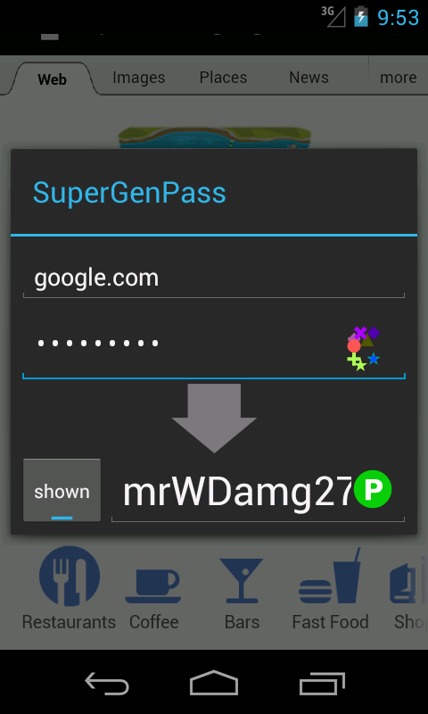

#  Android SuperGenPass utility

 This is an Android implementation of
[SuperGenPass](http://supergenpass.com/). SuperGenPass is a different kind of password manager:
instead of randomly-generating and storing passwords, it combines a Web site's domain and your
master password to generate a unique password for each Web site you visit using a strong
cryptographic hash.

In addition to using the form when you run the app, you can also use the "Share Page" menu item in
the Browser application to launch SGP and pre-fill the domain. Go to Menu → More → Share Page.

This app also includes a strong PIN generation algorithm. It's a slightly modified version of
[RFC4226 HOTP](http://tools.ietf.org/html/rfc4226) (modified to work with domains instead of
numerical counters) and is designed to never generate easily-guessable pins, such as 1234, 0000,
1985, 8675309, or 0007. For more details on how it works, please see the source.

## Download Binary Release

  * [Android SuperGenPass on Google Play](https://play.google.com/store/apps/details?id=info.staticfree.SuperGenPass)
  * [Android SuperGenPass on F-Droid](https://f-droid.org/packages/info.staticfree.SuperGenPass/)
  * [Android SuperGenPass apk](SuperGenPass.apk)

### Recent Changes

  * v2.2.3 - Bugfix: Major bugfix on PIN generation. If you generated a PIN using this app for a domain that contains a sub-domain (e.g. foo.example.org), the sub-domain was not properly stripped. This is now fixed so it works like SGP. To generate PINs in the same way as they were before this fix, disable domain checking in the Settings.
  * v2.2.2 - Bugfixes: fixes hardware keyboard focus issue; fixes lockup when generating PIN; fixes editablity of the password output field.
  * v2.2.1 - Adds PIN generation; clears passwords on screen off; adds unit tests
  * v2.1 - adds salt QR code scanning / generation; parses URLs (thanks Mike Tsao!); cleans up preference screen
  * v2.0.1 - fixes screen corruption bug with some 2.x devices
  * v2.0 - Major UI changes. New visual hash, Action Bar support, new launcher icon, new way of interacting, more.

## Source

The source for Android SGP is available via the [Android SGP git
repository](https://github.com/xxv/SuperGenPass). You can grab a copy for yourself by
running:

    git clone https://github.com/xxv/SuperGenPass.git

### License

The code is made available under the GPL v3

### Thanks!

### Contributors

Thanks to [Ari Pollak](http://ebnj.net) for cleaning up the UI to work better on rotation.

Thanks to Anthony Miceli for the password salt functionality.

Thanks to [Mike Tsao](http://www.sowbug.com/) for URL parsing.

